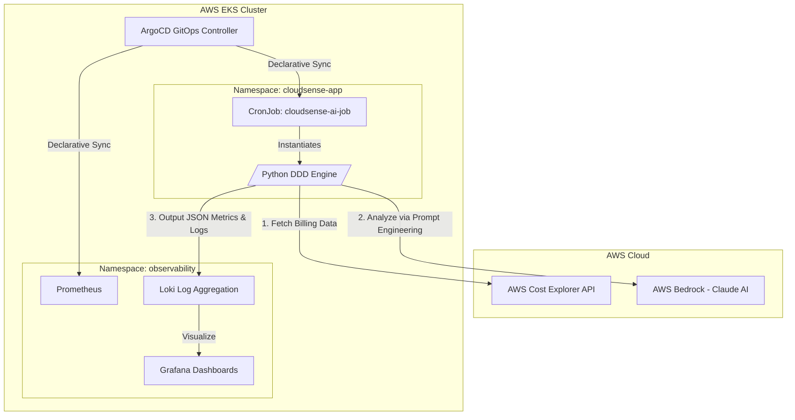
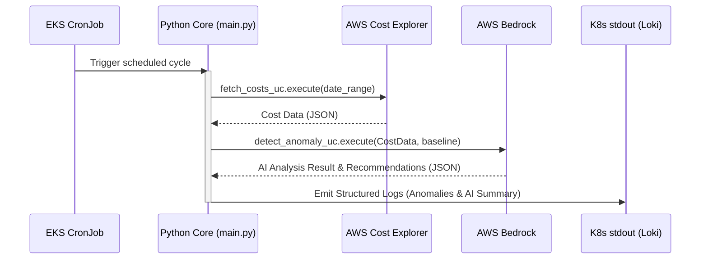

# CloudSense AI ☁️🤖

<div align="center">
  
  
  
  
  
</div>

<br />

> **A Multi-Account AWS FinOps Platform with AI Anomaly Detection and GitOps CI/CD.**

CloudSense AI is a professional DevOps/Cloud engineering project built to solve a crucial FinOps challenge: automatically identifying, analyzing, and explaining unexpected AWS billing spikes using **Generative AI** (AWS Bedrock / Claude).

---

## 🎯 Project Overview

This architecture leverages bleeding-edge Cloud Native and Machine Learning technologies to provide intelligent cost oversight. The system collects cost data from AWS, feeds it into an advanced AI model capable of financial reasoning, and emits highly detailed anomalies and actionable recommendations.

### Key Capabilities:
- **Intelligent FinOps**: Replaces manual cost analysis with automated AI evaluations.
- **GitOps Methodology**: Entire workload lifecycle is managed declaratively via ArgoCD on EKS.
- **Robust Software Engineering**: Python application strictly built using Domain-Driven Design (DDD) and Test-Driven Development (TDD). 
- **Full Observability Stack**: Prometheus, Promtail, Loki, and Grafana integrated for metrics and logs.
- **Infrastructure as Code**: End-to-end AWS provisioning with Terraform.

---

## 🏛️ Architecture & Workflow

### 1. High-Level Infrastructure (AWS & K8s)



### 2. Application Domain Flow (Python Engine)

The core logic operates as a scheduled Kubernetes Job, separating infrastructure from the business domain.



---

## 🚀 Technology Stack

| Domain | Technologies Used |
| :--- | :--- |
| **Cloud & FinOps** | AWS Services (EKS, IAM, VPC, Bedrock, Cost Explorer) |
| **Infrastructure as Code** | Terraform, Helm |
| **GitOps & Orchestration**| Kubernetes, ArgoCD, App of Apps Pattern |
| **Application Layer** | Python, Pydantic, Boto3, Domain-Driven Design (DDD) |
| **Testing & CI/CD** | Pytest (TDD), GitHub Actions, Makefiles |
| **Observability** | Prometheus, Loki, Grafana, Promtail |

---

## 💻 Repository Structure

```text
.
├── cloudsense-ai/
│   ├── src/                 # Python Engine (DDD Architecture)
│   │   ├── analysis/        # AI Anomaly Detection Domain
│   │   └── billing/         # AWS Cost Fetching Domain
│   ├── tests/               # Pytest TDD Suite
│   ├── terraform/           # IaC for VPC, EKS, IAM, and ArgoCD
│   ├── k8s/                 # Kubernetes Manifests & ArgoCD Apps
│   ├── dashboards/          # Grafana JSON Dashboards
│   ├── Makefile             # Abstracted Developer Operations
│   └── Dockerfile           # K8s Workload Image
└── README.md                # Project Documentation
```

---

## ⚙️ Execution & Demo Instructions

> **⚠️ WARNING:** This project provisions real AWS EKS infrastructure. To avoid unexpected charges, strictly follow the cleanup step after testing.

### Prerequisites
- AWS CLI configured with administrator credentials.
- `terraform`, `kubectl`, `docker`, and `make` installed.
- Python 3.11+ for local unit testing.

### 1. Verification (TDD Proof)
Validate the application's domain logic using the `Makefile` test wrapper:
```bash
cd cloudsense-ai
make test
```

### 2. Infrastructure Deployment
Automatically initialize Terraform, provision the EKS cluster, configure IAM OIDC, and bootstrap ArgoCD.
```bash
cd cloudsense-ai
make deploy
```
*Note: ArgoCD will automatically detect the Kubernetes manifests in the Git repository and sync the `cloudsense-ai-job` and observability stack.*

### 3. Run the AI Simulation
The Python engine runs natively as a managed Docker container in K8s. Perform a manual run to observe the AI analyzing an anomaly in real logs:
```bash
kubectl create job --from=cronjob/cloudsense-ai-job manual-run-1 -n cloudsense-app
kubectl logs -f job/manual-run-1 -n cloudsense-app
```

### 4. Cleanup (CRITICAL)
Destroy all K8s workloads and AWS resources gracefully to preserve cloud hygiene:
```bash
cd cloudsense-ai
make destroy
```

---

<div align="center">
  <p>Built as a demonstrator for modern Cloud Engineering, GitOps, and AI integrations.</p>
</div>
