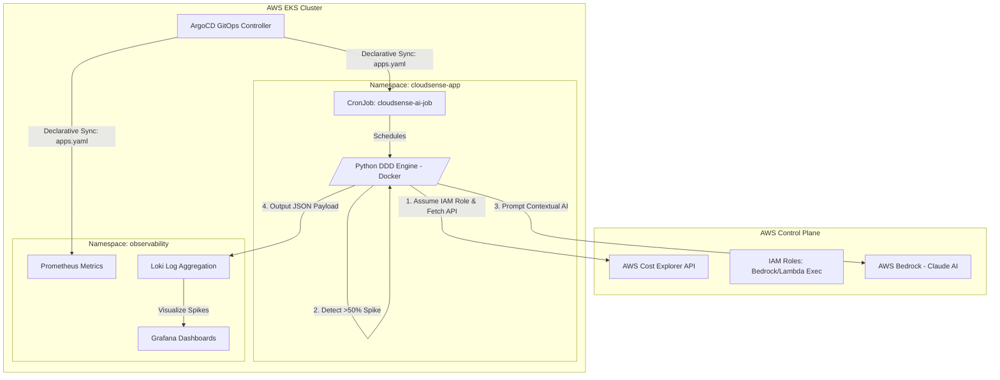
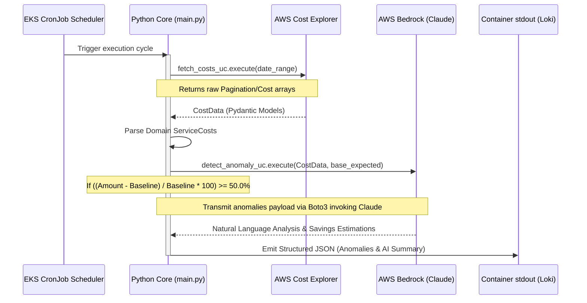

# CloudSense AI ☁️🤖

<div align="center">
  
  
  
  
  
  
</div>

<br />

> **A Multi-Account AWS FinOps Platform with AI Anomaly Detection and Declarative GitOps CI/CD.**

CloudSense AI is an enterprise-grade, DevOps/Cloud Engineering platform designed to solve one of the most persistent FinOps challenges: automatically identifying, contextualizing, and remediating unexpected AWS billing spikes. By integrating **Generative AI** (AWS Bedrock / Anthropic Claude), CloudSense moves beyond static alerting into the realm of intelligent financial reasoning and proactive recommendations.

---

## 🎯 Project Overview & Core Differentiators

Unlike standard AWS Budgets or basic Cost Explorer alerts, this architecture leverages real-time Cloud Native orchestration and Machine Learning models to provide "human-readable" cost oversight. The system collects cost data from AWS, feeds the anomalous datasets into an advanced LLM capable of FinOps reasoning, and emits highly detailed metrics and remediation steps.

### Deep-Dive Capabilities:
- **Intelligent FinOps Reasoning**: Anomaly detection logic (`>50%` above expected baselines) automatically triggers a consultative AI review using Bedrock's `InvokeModel` APIs.
- **GitOps App of Apps Methodology**: The entire cluster workload lifecycle (`cloudsense-app`, `observability`) is managed purely via declarative state using ArgoCD directly synced to this repository.
- **Strict Domain-Driven Design (DDD)**: Python business logic is cleanly decoupled into `billing` (fetch mechanisms) and `analysis` (AI reasoning) domains, entirely independent of the infrastructure layer.
- **Test-Driven Development (TDD)**: Comprehensive unit tests developed before the business logic, fully ensuring reliable and reproducible AI integrations and cost transformations.
- **End-to-End Infrastructure as Code (IaC)**: Granular Terraform definitions for AWS VPC networking, EKS Clusters, IAM policies, and Helm Provider deployments.
- **Full Observability Stack**: Prometheus (metrics tracing), Loki (log aggregation), and Grafana integrated to visualize the JSON-structured anomalies emitted by the K8s CronJob.

---

## 🏛️ Comprehensive Architecture & Workflows

### 1. High-Level Infrastructure (AWS & Kubernetes Topology)

The architecture is explicitly designed around ephemeral, containerized job execution to maintain minimal compute footprints while polling for FinOps spikes.



### 2. Python Application Domain Flow (DDD Implementation)

The Python core engine acts as a bridge between data fetching (`FetchCostsUseCase`) and intelligent processing (`DetectAnomalyUseCase`).



---

## 🧠 Business Logic Deep Dive: Anomaly Detection

Located in `src/analysis/application/detect_anomaly.py`, the `DetectAnomalyUseCase` is the brain of the platform.

1. **Threshold Filtering:** The system implements a hard threshold (`self.anomaly_threshold_percent = 50.0`). Any AWS service experiencing a daily cost spike 50% above the dynamically calculated or hardcoded baseline is flagged as an anomaly.
2. **Contextual Aggregation:** Flagged anomalies are aggregated into a specialized prompt structure.
3. **AI Consultation:** The structured anomalies are sent to AWS Bedrock. The Claude model is instructed to act as an AWS FinOps engineer.
4. **Actionable Recommendations:** The AI responds with human-readable reasoning and explicit `Recommendation` objects, calculating the precise *estimated savings* if the anomalous resources are terminated.

---

## 🧱 Infrastructure Details

### Terraform (`/terraform`)
- **`eks.tf` & `networking.tf`**: Provisions a highly available EKS cluster spread across multiple AZs within a dedicated VPC.
- **`iam.tf`**: Enforces the principle of least privilege. Creates specific execution roles with strictly scoped `bedrock:InvokeModel` policies, ensuring the container can only perform authorized AI inferences.
- **`argocd.tf`**: Uses the Terraform Helm provider to bootstrap ArgoCD directly into the fresh EKS cluster automatically.

### Kubernetes & GitOps (`/k8s`)
- **App of Apps Pattern (`/k8s/argocd/applications.yaml`)**: ArgoCD monitors the root Git repository and orchestrates two primary child applications: `cloudsense-observability` and `cloudsense-app`.
- **Stateless CronJobs (`/k8s/app/cronjob.yaml`)**: The Python application is wrapped in a Docker image and executed on a Kubernetes chron schedule, simulating serverless behaviors inside an orchestrated cluster.

---

## 🚀 Deployment & Demo Instructions

> **⚠️ CRITICAL WARNING:** This project provisions real AWS EKS clusters and invokes Bedrock models. You **MUST** run the Cleanup (`make destroy`) sequence immediately after your demo to avoid sustained cloud charges.

### Prerequisites Ecosystem
- **AWS CLI** authenticated with `AdministratorAccess` (to provision EKS/IAM).
- Dedicated tooling: `terraform`, `kubectl`, `docker`, and GNU `make`.
- **AWS Bedrock Access:** You must have the Anthropic Claude models explicitly enabled/granted in your AWS Bedrock console for the target region.

### Step 1: Execute The Test Suite (TDD Verification)
Prove the structural integrity of the pure Python Domain logic without external dependencies.
```bash
cd cloudsense-ai
make test
```

### Step 2: Bootstrap Infrastructure & GitOps
Initialize Terraform modules, create the VPC + EKS cluster, deploy the Helm charts, and apply the ArgoCD GitOps root manifests.
```bash
cd cloudsense-ai
make deploy
```
*Note: ArgoCD immediately takes over. It resolves the K8s state against the Github repository and synchronizes the observability namespaces and CronJobs.*

### Step 3: Trigger the AI Anomaly Simulation
Because the system operates as a scheduled `CronJob`, you can manually trigger a K8s Job to watch the AI evaluate simulated backend workloads immediately:
```bash
kubectl create job --from=cronjob/cloudsense-ai-job manual-run-test -n cloudsense-app
kubectl logs -f job/manual-run-test -n cloudsense-app
```
*Observe the JSON output payload where Claude explains the anomalous spending and suggests exact remediations.*

### Step 4: CLEANUP (Mandatory)
Eliminate all cloud footprints. This purges the Helm releases, the EKS cluster, the VPC, and all associated IAM roles gracefully.
```bash
cd cloudsense-ai
make destroy
```

---

<div align="center">
  <p><b>CloudSense AI</b> — Where Cloud Modernization Meets Generative AI.</p>
</div>
