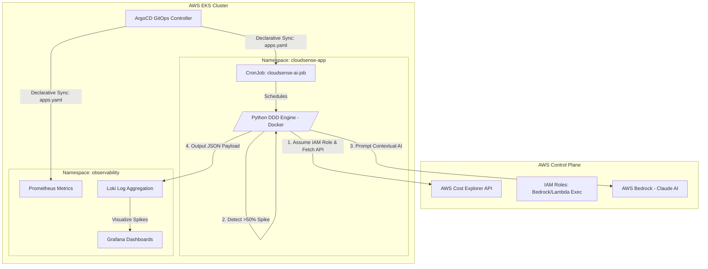
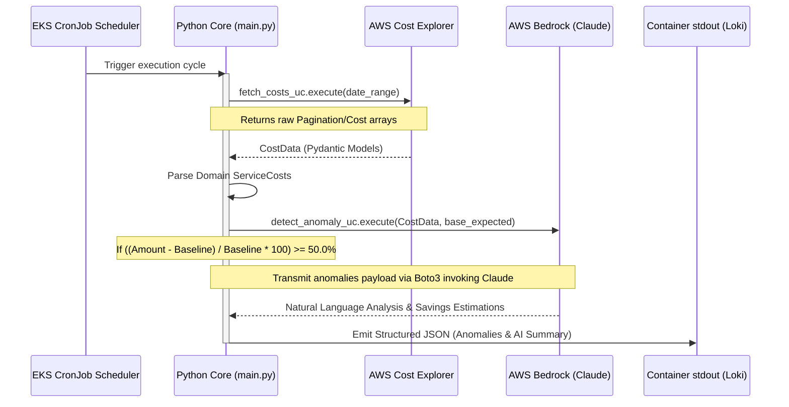

# CloudSense AI ☁️🤖

<div align="center">
  
  
  
  
  
  
</div>

<br />

> **A Professional Multi-Account AWS FinOps Platform integrating Generative AI Anomaly Detection and Declarative GitOps CI/CD.**

---

## 👔 For Hiring Managers & Technical Recruiters

Welcome! This repository is engineered specifically to demonstrate **Senior Cloud/DevOps Engineering competency**. It reflects modern, enterprise-grade development standards that prioritize reliability, automation, and clear architectural boundaries.

### 🌟 Business Value & The Problem Solved
Traditional AWS Cost anomaly detection often generates alert fatigue (e.g., "Cost increased by $500"). **CloudSense AI** solves this by leveraging **Generative AI (Claude via AWS Bedrock)** to act as an automated FinOps consultant. When an anomaly is detected, the system queries the LLM with the raw billing data, which responds with human-readable context and explicit remediation steps (e.g., "Terminate unused EC2 instances in us-east-1 to save $400"). 

### 🛠️ Demonstrated Senior Engineering Practices:
- **Test-Driven Development (TDD):** Every domain logic rule is thoroughly unit-tested using the `unittest.mock` framework before reaching production. The CI validation (`make test`) isolates the business logic from the AWS SDK by injecting mock Bedrock clients.
- **Domain-Driven Design (DDD):** CloudSense physically separates infrastructure delivery (`k8s/`, `terraform/`) from the Python business domains (`src/billing/`, `src/analysis/`). 
- **GitOps App of Apps:** The repository acts as the absolute source of truth. ArgoCD continually reconciles the live EKS cluster state against the GitHub source, eliminating configuration drift.
- **Operational Abstraction:** Complex deployment sequences (Terraform apply, Kubeconfig updates, EKS integrations) are elegantly hidden behind a heavily orchestrated `Makefile`.
- **Stateless Containerization:** The Python engine is bundled in a minimal `slim` Docker image and executes ephemerally as a Kubernetes CronJob.

---

## 🏛️ Comprehensive Architecture & Flow

### 1. High-Level Infrastructure (AWS & Kubernetes Topology)

The architecture is explicitly designed around ephemeral, containerized job execution to maintain minimal compute footprints while polling for FinOps spikes.



### 2. Python Application Domain Flow (DDD Implementation)

The Python core engine acts as a bridge between data fetching (`FetchCostsUseCase`) and intelligent processing (`DetectAnomalyUseCase`).



---

## 🧠 Business Logic Deep Dive & Real Project Code

### 1. Anomaly Detection Engine (`src/analysis/application/detect_anomaly.py`)
Located in the core application logic, the `DetectAnomalyUseCase` implements a hard threshold (`self.anomaly_threshold_percent = 50.0`). Any AWS service experiencing a daily cost spike 50% above expectations is flagged. Once aggregated, the AI consultation occurs, returning `Recommendation` objects with precise *estimated savings*.

### 2. TDD Mock Ecosystem (`tests/test_analysis.py`)
To prevent testing logic from incurring real AWS SDK charges, the TDD suite aggressively mocks `ClaudeBedrockClient`. The test asserts that a simulated `AmazonEC2` spike (from $50 to $400) correctly triggers the `analyze_anomalies` payload:
```python
def test_detect_anomaly_triggers_alert_on_spike():
    mock_bedrock = Mock(spec=ClaudeBedrockClient)
    mock_bedrock.analyze_anomalies.return_value = {"summary": "Mock summary"}
    
    use_case = DetectAnomalyUseCase(mock_bedrock)
    
    # Simulate Date & Cost Spike Data
    cost_data = CostData(...) # 800% Spike
    
    result = use_case.execute(cost_data, expected_daily_cost=150.0)
    
    assert len(result.anomalies) == 1
    assert result.anomalies[0].actual_amount == 400.0
    mock_bedrock.analyze_anomalies.assert_called_once()
```

### 3. GitOps App of Apps (`k8s/argocd/applications.yaml`)
Instead of `kubectl apply` scaling issues, ArgoCD monitors this repository directly. The `applications.yaml` file defines parent components, instructing K8s to pull continuous cluster state strictly from the Git branches targeting `namespace: cloudsense-app` and `namespace: observability`.

---

## 🚀 Execution & Demo Instructions

> **⚠️ CRITICAL WARNING:** This project provisions real AWS EKS clusters and invokes Bedrock models. You **MUST** run the Cleanup (`make destroy`) sequence immediately after your demo to avoid sustained cloud charges.

### Step 1: Execute The Test Suite (TDD Verification)
Prove the structural integrity of the pure Python Domain logic.
```bash
make test
```

### Step 2: Bootstrap Infrastructure & GitOps
Initialize Terraform modules, create the VPC + EKS cluster, deploy the Helm charts, and apply the ArgoCD GitOps templates.
```bash
make deploy
```
*Note: The `make deploy` abstraction handles `terraform apply -auto-approve` and automatically wires the AWS `kubeconfig` to the local environment.*

### Step 3: Trigger the AI Anomaly Simulation
Because the system operates statelessly as a K8s `CronJob` (`k8s/app/cronjob.yaml`), trigger a manual Job instance to observe the AI parsing logs live:
```bash
kubectl create job --from=cronjob/cloudsense-ai-job manual-run-test -n cloudsense-app
kubectl logs -f job/manual-run-test -n cloudsense-app
```

### Step 4: CLEANUP (Mandatory)
Eliminate all cloud footprints gracefully. This purges the Helm releases, the EKS cluster, VPC limits, and IAM boundaries.
```bash
make destroy
```

---

<div align="center">
  <p><b>CloudSense AI</b> — Crafted to showcase robust Cloud Modernization & Generative AI integrations.</p>
</div>
